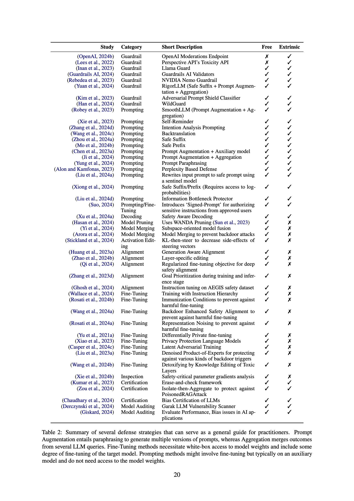

## Defenses
<!--  -->

| Study | Category | Short Description | Free | Extrinsic |
|-------|----------|-------------------|------|-----------|
| [OpenAI Moderation Endpoint](https://platform.openai.com/docs/guides/moderation/overview) | Guardrail | OpenAI Moderations Endpoint | ❌ | ✅ |
| [A New Generation of Perspective API: Efficient Multilingual Character-level Transformers](https://api.semanticscholar.org/CorpusID:247058801) | Guardrail | Perspective API's Toxicity API | ❌ | ✅ |
| [Llama Guard: LLM-based Input-Output Safeguard for Human-AI Conversations](https://api.semanticscholar.org/CorpusID:266174345) | Guardrail | Llama Guard | ✅ | ✅ |
| [Guardrails AI: Adding guardrails to large language models.](https://github.com/guardrails-ai/guardrails) | Guardrail | Guardrails AI Validators | ✅ | ✅ |
| [NeMo Guardrails: A Toolkit for Controllable and Safe LLM Applications with Programmable Rails](https://api.semanticscholar.org/CorpusID:264146531) | Guardrail | NVIDIA Nemo Guardrail | ✅ | ✅ |
| [RigorLLM: Resilient Guardrails for Large Language Models against Undesired Content](https://api.semanticscholar.org/CorpusID:268536710) | Guardrail | RigorLLM (Safe Suffix + Prompt Augmentation + Aggregation) | ✅ | ✅ |
| [Robust Safety Classifier for Large Language Models: Adversarial Prompt Shield](https://api.semanticscholar.org/CorpusID:264833136) | Guardrail | Adversarial Prompt Shield Classifier | ✅ | ✅ |
| [WildGuard: Open One-Stop Moderation Tools for Safety Risks, Jailbreaks, and Refusals of LLMs](https://api.semanticscholar.org/CorpusID:270737916) | Guardrail | WildGuard | ✅ | ✅ |
| [SmoothLLM: Defending Large Language Models Against Jailbreaking Attacks](https://api.semanticscholar.org/CorpusID:263671542) | Prompting | SmoothLLM (Prompt Augmentation + Aggregation) | ✅ | ✅ |
| [Defending ChatGPT against jailbreak attack via self-reminders](https://api.semanticscholar.org/CorpusID:266289038) | Prompting | Self-Reminder | ✅ | ✅ |
| [Intention Analysis Prompting Makes Large Language Models A Good Jailbreak Defender](https://api.semanticscholar.org/CorpusID:266977251) | Prompting | Intention Analysis Prompting | ✅ | ✅ |
| [Defending LLMs against Jailbreaking Attacks via Backtranslation](https://api.semanticscholar.org/CorpusID:268032484) | Prompting | Backtranslation | ✅ | ✅ |
| [Robust Prompt Optimization for Defending Language Models Against Jailbreaking Attacks](https://api.semanticscholar.org/CorpusID:267320750) | Prompting | Safe Suffix | ✅ | ✅ |
| [Studious Bob Fight Back Against Jailbreaking via Prompt Adversarial Tuning](https://api.semanticscholar.org/CorpusID:267617138) | Prompting | Safe Prefix | ✅ | ✅ |
| [Jailbreaker in Jail: Moving Target Defense for Large Language Models](https://api.semanticscholar.org/CorpusID:263620259) | Prompting | Prompt Augmentation + Auxiliary model | ✅ | ✅ |
| [Defending Large Language Models against Jailbreak Attacks via Semantic Smoothing](https://api.semanticscholar.org/CorpusID:267938320) | Prompting | Prompt Augmentation + Aggregation | ✅ | ✅ |
| [Round Trip Translation Defence against Large Language Model Jailbreaking Attacks](https://api.semanticscholar.org/CorpusID:267770468) | Prompting | Prompt Paraphrasing | ✅ | ✅ |
| [Detecting Language Model Attacks with Perplexity](https://api.semanticscholar.org/CorpusID:261245172) | Prompting | Perplexity Based Defense | ✅ | ✅ |
| [Tiny Refinements Elicit Resilience: Toward Efficient Prefix-Model Against LLM Red-Teaming](https://api.semanticscholar.org/CorpusID:269929930) | Prompting | Rewrites input prompt to safe prompt using a sentinel model | ✅ | ✅ |
| [Defensive Prompt Patch: A Robust and Interpretable Defense of LLMs against Jailbreak Attacks](https://api.semanticscholar.org/CorpusID:270123437) | Prompting | Safe Suffix/Prefix (Requires access to log-probabilities) | ✅ | ✅ |
| [Protecting Your LLMs with Information Bottleneck](https://api.semanticscholar.org/CorpusID:269293591) | Prompting | Information Bottleneck Protector | ✅ | ✅ |
| [Signed-Prompt: A New Approach to Prevent Prompt Injection Attacks Against LLM-Integrated Applications](https://api.semanticscholar.org/CorpusID:266999840) | Prompting/Fine-Tuning | Introduces 'Signed-Prompt' for authorizing sensitive instructions from approved users | ✅ | ✅ |
| [SafeDecoding: Defending against Jailbreak Attacks via Safety-Aware Decoding](https://api.semanticscholar.org/CorpusID:267658033) | Decoding | Safety Aware Decoding | ✅ | ✅ |
| [Pruning for Protection: Increasing Jailbreak Resistance in Aligned LLMs Without Fine-Tuning](https://api.semanticscholar.org/CorpusID:267060803) | Model Pruning | Uses WANDA Pruning | ✅ | ❌ |
| [A safety realignment framework via subspace-oriented model fusion for large language models](https://api.semanticscholar.org/CorpusID:269773206) | Model Merging | Subspace-oriented model fusion | ✅ | ❌ |
| [Here's a Free Lunch: Sanitizing Backdoored Models with Model Merge](https://api.semanticscholar.org/CorpusID:268091274) | Model Merging | Model Merging to prevent backdoor attacks | ✅ | ❌ |
| [Steering Without Side Effects: Improving Post-Deployment Control of Language Models](https://api.semanticscholar.org/CorpusID:270703306) | Activation Editing | KL-then-steer to decrease side-effects of steering vectors | ✅ | ❌ |
| [Catastrophic Jailbreak of Open-source LLMs via Exploiting Generation](https://api.semanticscholar.org/CorpusID:263835408) | Alignment | Generation Aware Alignment | ✅ | ❌ |
| [Defending Large Language Models Against Jailbreak Attacks via Layer-specific Editing](https://api.semanticscholar.org/CorpusID:270067915) | Alignment | Layer-specific editing | ✅ | ❌ |
| [Safety Alignment Should Be Made More Than Just a Few Tokens Deep](https://api.semanticscholar.org/CorpusID:270371778) | Alignment | Regularized fine-tuning objective for deep safety alignment | ✅ | ❌ |
| [Defending Large Language Models Against Jailbreaking Attacks Through Goal Prioritization](https://api.semanticscholar.org/CorpusID:265212812) | Alignment | Goal Prioritization during training and inference stage | ✅ | ❌ |
| [AEGIS: Online Adaptive AI Content Safety Moderation with Ensemble of LLM Experts](https://api.semanticscholar.org/CorpusID:269009460) | Alignment | Instruction tuning on AEGIS safety dataset | ✅ | ❌ |
| [Vaccine: Perturbation-aware Alignment for Large Language Models against Harmful Fine-tuning Attack](https://www.semanticscholar.org/paper/Vaccine%3A-Perturbation-aware-Alignment-for-Large-Huang-Hu/abdb6e912fe86a60600b438b0e36b502f6412b24) | Alignment | Adding perturbation to embeddings in alignment phase | ✅ | ❌ |
| [Lazy Safety Alignment for Large Language Models against Harmful Fine-tuning](https://www.semanticscholar.org/paper/Lazy-Safety-Alignment-for-Large-Language-Models-Huang-Hu/22151f8690cd06dba9e934cda6121e26dd9a8e7f) | Alignment | Bi-state optimization with constrained drift | ✅ | ❌ |
| [Antidote: Post-fine-tuning Safety Alignment for Large Language Models against Harmful Fine-tuning](https://www.semanticscholar.org/paper/Antidote%3A-Post-fine-tuning-Safety-Alignment-for-Huang-Bhattacharya/be4156b6c5b804af6a20e5f723e521df6981b6fc) | Alignment | Removes harmful parameters | ✅ | ❌ |
| [Booster: Tackling Harmful Fine-tuning for Large Language Models via Attenuating Harmful Perturbation](https://www.semanticscholar.org/reader/e002b6ce5283d88ce0c21afbca27b3aea091e78f)| Alignment | Auxiliary loss to attenuate harmful perturbation | ✅ | ❌ |
| [The Instruction Hierarchy: Training LLMs to Prioritize Privileged Instructions](https://api.semanticscholar.org/CorpusID:269294048) | Fine-Tuning | Training with Instruction Hierarchy | ✅ | ❌ |
| [Immunization against harmful fine-tuning attacks](https://api.semanticscholar.org/CorpusID:268032044) | Fine-Tuning | Immunization Conditions to prevent against harmful fine-tuning | ✅ | ❌ |
| [Mitigating Fine-tuning Jailbreak Attack with Backdoor Enhanced Alignment](https://api.semanticscholar.org/CorpusID:267897454) | Fine-Tuning | Backdoor Enhanced Safety Alignment to prevent against harmful fine-tuning | ✅ | ❌ |
| [Representation noising effectively prevents harmful fine-tuning on LLMs](https://api.semanticscholar.org/CorpusID:269982864) | Fine-Tuning | Representation Noising to prevent against harmful fine-tuning | ✅ | ❌ |
| [Differentially Private Fine-tuning of Language Models](https://api.semanticscholar.org/CorpusID:238743879) | Fine-Tuning | Differentially Private fine-tuning | ✅ | ❌ |
| [Large Language Models Can Be Good Privacy Protection Learners](https://api.semanticscholar.org/CorpusID:263620236) | Fine-Tuning | Privacy Protection Language Models | ✅ | ❌ |
| [Mitigating Privacy Risks in LLM Embeddings from Embedding Inversion](https://arxiv.org/abs/2411.05034) | Fine-Tuning | Eguard - transformer-based projection network to protect embeddings against inversion attacks | ✅ | ❌ |
| [Defending Against Unforeseen Failure Modes with Latent Adversarial Training](https://api.semanticscholar.org/CorpusID:268297448) | Fine-Tuning | Latent Adversarial Training | ✅ | ❌ |
| [From Shortcuts to Triggers: Backdoor Defense with Denoised PoE](https://api.semanticscholar.org/CorpusID:258866191) | Fine-Tuning | Denoised Product-of-Experts for protecting against various kinds of backdoor triggers | ✅ | ❌ |
| [Detoxifying Large Language Models via Knowledge Editing](https://api.semanticscholar.org/CorpusID:268553537) | Fine-Tuning | Detoxifying by Knowledge Editing of Toxic Layers | ✅ | ❌ |
| [GradSafe: Detecting Jailbreak Prompts for LLMs via Safety-Critical Gradient Analysis](https://api.semanticscholar.org/CorpusID:267770418) | Inspection | Safety-critical parameter gradients analysis | ✅ | ❌ |
| [Certifying LLM Safety against Adversarial Prompting](https://doi.org/10.48550/arXiv.2309.02705) | Certification | Erase-and-check framework | ✅ | ✅ |
| [PoisonedRAG: Knowledge Poisoning Attacks to Retrieval-Augmented Generation of Large Language Models](https://api.semanticscholar.org/CorpusID:267626957) | Certification | Isolate-then-Aggregate to protect against PoisonedRAGAttack | ✅ | ✅ |
| [Quantitative Certification of Bias in Large Language Models](https://api.semanticscholar.org/CorpusID:270094829) | Certification | Bias Certification of LLMs | ✅ | ✅ |
| [C-RAG: Certified Generation Risks for Retrieval-Augmented Language Models](https://arxiv.org/abs/2402.03181) | Certification | Framework providing provable guarantees on generation risks in RAG models | ✅ | ✅ |
| [garak: A Framework for Security Probing Large Language Models](https://api.semanticscholar.org/CorpusID:270559825) | Model Auditing | Garak LLM Vulnerability Scanner | ✅ | ✅ |
| [giskard: The Evaluation & Testing framework for LLMs & ML models](https://github.com/Giskard-AI/giskard) | Model Auditing | Evaluate Performance, Bias issues in AI applications | ✅ | ✅ |

## Holistic Defense

| Study | Category | Short Description | Free | Extrinsic |
|-------|----------|-------------------|------|-----------|
| [AutoDefense: Multi-Agent LLM Defense against Jailbreak Attacks](https://arxiv.org/abs/2403.04783) | Multi-Agent Defense | A multi-agent framework that filters harmful responses from LLMs | ✅ | ✅ |
| [Swiss Cheese Model for AI Safety: A Taxonomy and Reference Architecture for Multi-Layered Guardrails of Foundation Model Based Agents](https://arxiv.org/abs/2408.02205) | Multi-Layered Defense | A reference architecture inspired by the Swiss Cheese Model for designing multi-layered guardrails | ✅ | ✅ |
| [LeakSealer: A Semisupervised Defense for LLMs Against Prompt Injection and Leakage Attacks](https://arxiv.org/abs/2508.00602) | Other Design Choices | A model-agnostic approach producing semantic fingerprints for adversarial prompts via clustering. | ❌ | ✅ |

---