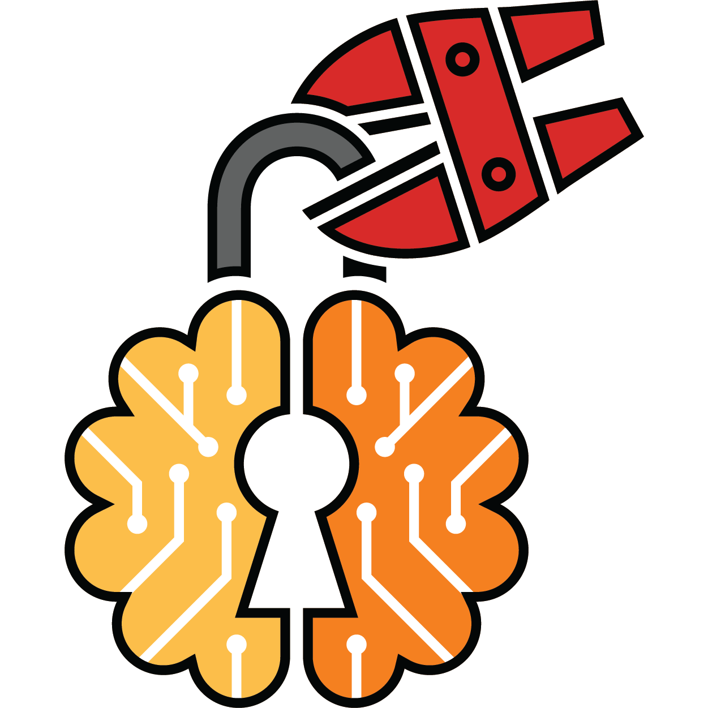

# Awesome Red-Teaming LLMs [](https://awesome.re)
> A comprehensive guide to understanding Attacks, Defenses and Red-Teaming for Large Language Models (LLMs).

<div align="center">
	
<br>
</div>

[](https://twitter.com/verma_apurv5/status/1815751139729519011)
[](https://arxiv.org/pdf/2407.14937)


## Contents
- [Attacks](Attacks.md)
  - [Direct Attack](Attacks.md#direct-attack)
  - [Infusion Attack](Attacks.md#infusion-attack)
  - [Inference Attack](Attacks.md#inference-attack)
  - [Training Attack](Attacks.md#training-attack)
- [Defenses](Defenses.md)
- [Other Surveys](#other-surveys)
- [Red-Teaming](#red-teaming)

## Red-Teaming Attack Taxonomy


## Other Surveys
| Title | Link |
|-------|------|
| SoK: Prompt Hacking of Large Language Models | [Link](https://www.semanticscholar.org/paper/SoK%3A-Prompt-Hacking-of-Large-Language-Models-Rababah-Wu/9259d06eeaae42b05ad22ba76f0a1cbb216ad63a) |
| A Survey on Trustworthy LLM Agents: Threats and Countermeasures | [Link](https://arxiv.org/abs/2503.09648) |
| The Emerged Security and Privacy of LLM Agent: A Survey with Case Studies | [Link](https://arxiv.org/abs/2407.19354) |


## Red-Teaming
| Title | Link |
|-------|------|
| Red-Teaming for Generative AI: Silver Bullet or Security Theater? | [Link](https://ojs.aaai.org/index.php/AIES/article/view/31647) |
| Lessons From Red Teaming 100 Generative AI Products | [Link](https://arxiv.org/abs/2501.07238) |
| Rainbow Teaming: Open-Ended Generation of Diverse Adversarial Prompts | [Link](https://arxiv.org/abs/2402.16822) |
| Red-Teaming LLM Multi-Agent Systems via Communication Attacks | [Link](https://arxiv.org/abs/2502.14847) |
| Red Teaming the Mind of the Machine: A Systematic Evaluation of Prompt Injection and Jailbreak Vulnerabilities in LLMs | [Link](https://arxiv.org/abs/2505.04806) |
| Red-Teaming LLM Multi-Agent Systems via Communication Attacks | [Link](https://arxiv.org/abs/2502.14847) |
| TRIDENT: Enhancing Large Language Model Safety with Tri-Dimensional Diversified Red-Teaming Data Synthesis | [Link](https://arxiv.org/abs/2505.24672) |
| The State of Multilingual LLM Safety Research: From Measuring the Language Gap to Mitigating It | [Link](https://arxiv.org/abs/2505.24119) |
| RedTeamCUA: Realistic Adversarial Testing of Computer-Use Agents in Hybrid Web-OS Environments | [Link](https://arxiv.org/abs/2505.21936) |
|
| RRTL: Red Teaming Reasoning Large Language Models in Tool Learning | [Link](https://arxiv.org/abs/2505.17106) |
| Capability-Based Scaling Laws for LLM Red-Teaming | [Link](https://arxiv.org/abs/2505.20162) |


If you like our work, please consider citing. If you would like to add your work to our taxonomy please open a pull request.

#### BibTex
```bibtex

@article{verma2024operationalizing,
  title={Operationalizing a Threat Model for Red-Teaming Large Language Models (LLMs)},
  author={Verma, Apurv and Krishna, Satyapriya and Gehrmann, Sebastian and Seshadri, Madhavan and Pradhan, Anu and Ault, Tom and Barrett, Leslie and Rabinowitz, David and Doucette, John and Phan, NhatHai},
  journal={arXiv preprint arXiv:2407.14937},
  year={2024}
}
```
